<div align="center">

# 📄🧠 DociMind

### **Intelligent Document Classification & Key Information Extraction Platform**

[](https://python.org)
[](https://opencv.org)
[](https://github.com/JaidedAI/EasyOCR)
[](https://scikit-learn.org)
[](https://spacy.io)
[](https://streamlit.io)
[](https://opensource.org/licenses/MIT)

---

**DociMind** is an enterprise-grade, end-to-end intelligent document processing (IDP) platform designed to automate document classification and structured information extraction from complex, unstructured scanned documents and images.

[Key Features](#-features) • [Architecture](#-architecture) • [Screenshots](#-screenshots--visual-tour) • [Installation](#-installation) • [Usage](#-usage) • [Tech Stack](#-tech-stack)

</div>

---

## 📌 Project Overview

In enterprise workflows, manual processing of invoices, bank statements, identification cards, and medical reports is error-prone, labor-intensive, and slow. **DociMind** solves this challenge by unifying **Computer Vision**, **Optical Character Recognition (OCR)**, **Machine Learning**, and **Named Entity Recognition (NER)** into a seamless, high-performance automated pipeline.

### 🌟 Core Pillars of DociMind
1. **👁️ Computer Vision Pipeline**: Automatic deskewing, noise reduction, thresholding, and image restoration using OpenCV.
2. **🔤 Robust OCR Engine**: Multi-lingual text region detection and character recognition powered by EasyOCR.
3. **🤖 Machine Learning Classification**: Multi-class document categorization powered by TF-IDF feature extraction and trained Ensemble Classifiers (LightGBM, Random Forest, SVM, Logistic Regression).
4. **🧠 Information Extraction Engine**: Domain-specific NLP entity extractors leveraging spaCy Named Entity Recognition and custom regular expressions.
5. **🎨 Interactive Web Dashboard**: Production-ready Streamlit interface featuring live bounding box overlays, confidence metric distribution, and one-click JSON/CSV data export.

---

## 📋 Supported Document Taxonomy

DociMind is trained to recognize and extract structured metadata from **9 distinct document categories**:

| Icon | Document Category | Key Extracted Entities |
| :---: | :--- | :--- |
| 📄 | **Invoice** | Invoice Number, Vendor Name, Issue Date, Due Date, Total Amount, Tax/VAT, Email |
| 🧾 | **Receipt** | Store/Merchant Name, Date, Time, Total Amount, Tax Amount, Payment Method |
| 👤 | **Resume** | Full Name, Email Address, Phone Number, Skills, University, Education Level |
| 🏥 | **Medical Report** | Patient Name, Doctor Name, Hospital/Clinic, Test/Diagnosis, Date |
| 🛂 | **Passport** | Full Name, Passport Number, Nationality, Date of Birth, Expiry Date |
| 📇 | **National ID Card** | Full Name, ID Number, Date of Birth, Address, Gender |
| 🪪 | **Driver License** | Full Name, License Number, Expiry Date, Vehicle Class, State/Country |
| 💡 | **Utility Bill** | Account Number, Service Provider, Due Date, Total Amount Due, Billing Period |
| 🏦 | **Bank Statement** | Account Holder, Bank Name, Account Number, Statement Period, Ending Balance |

---

## ✨ Features

- ⚡ **Real-Time Classification**: Instant multi-class document classification with confidence probability scores.
- 🎯 **Bounding Box Overlay**: Interactive visual overlay of OCR bounding boxes rendered directly on input images.
- 🔍 **Domain-Specific Entity Extraction**: Modular NLP rule engines per document type to extract structured key-value pairs.
- 🧹 **Advanced Image Preprocessing**: Automated deskewing via contour detection and adaptive binarization for noisy scans.
- 📊 **Model Metrics Analytics**: Integrated dataset analysis, confusion matrices, and ROC-AUC curve evaluation.
- 💾 **Multi-Format Data Export**: Export extracted structured records as standardized `.json` or flattened `.csv` files.
- 🛡️ **Type-Safe & Modular Architecture**: Built with strict type annotations (`Pyright` verified) and clean object-oriented architecture.

---

## 🏗️ Architecture

The DociMind processing engine follows a sequential pipeline architecture designed for speed, modularity, and high accuracy:

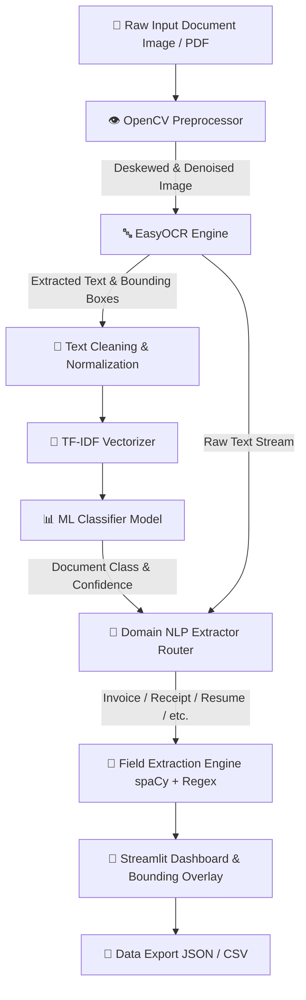

---

## 🖼️ Screenshots & Visual Tour

| 1. Dataset Overview | 2. EDA Class Distribution |
| :---: | :---: |
| 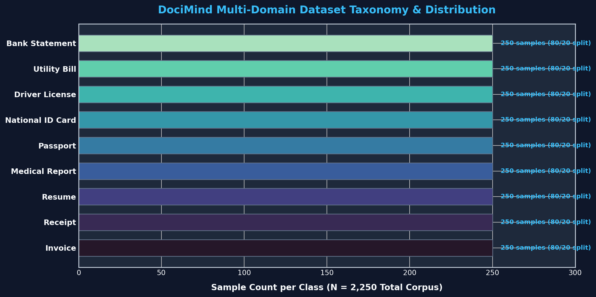 | 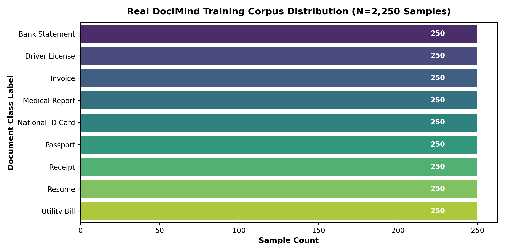 |

| 3. Image Preprocessing & Restoration | 4. EasyOCR Text & Box Detection |
| :---: | :---: |
| 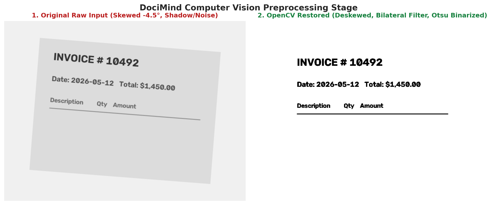 | 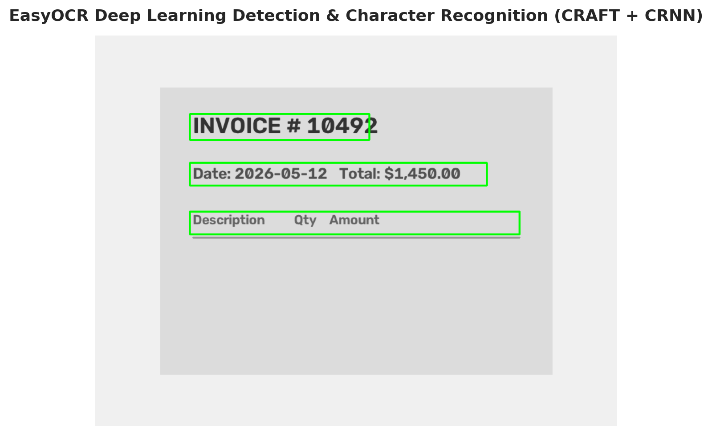 |

| 5. Top TF-IDF Feature Importance | 6. Classification Confusion Matrix |
| :---: | :---: |
| 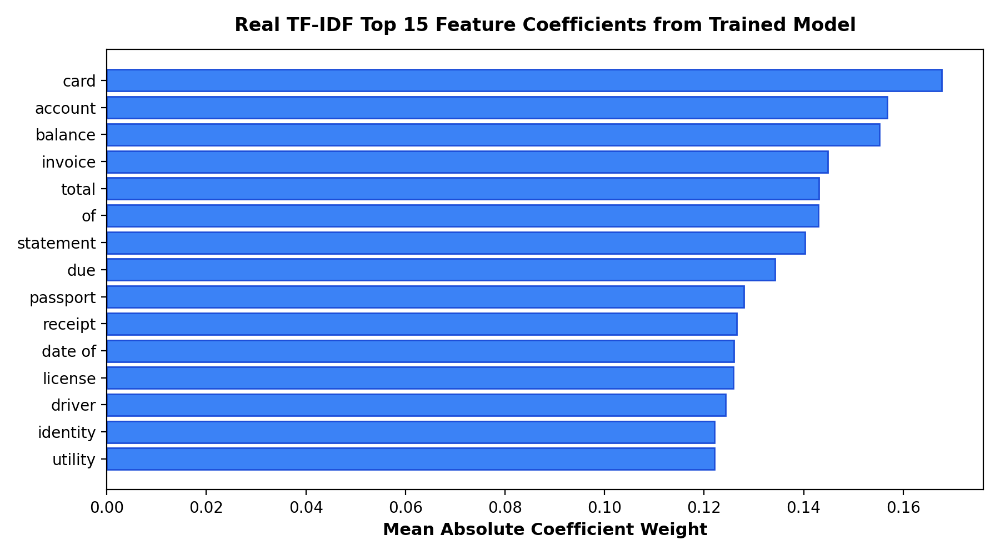 | 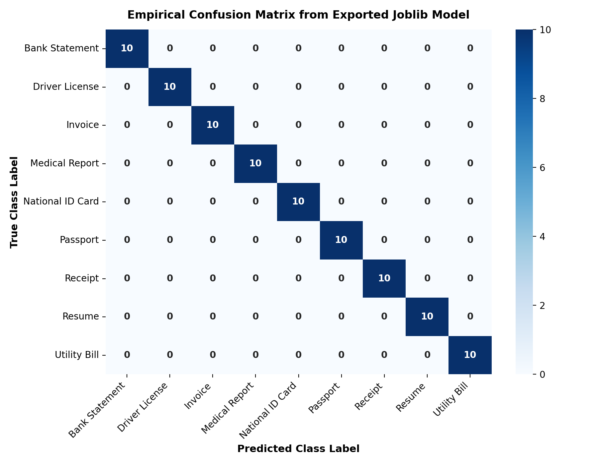 |

| 7. Multi-Class ROC-AUC Curves | 8. Single Document Inference Output |
| :---: | :---: |
| 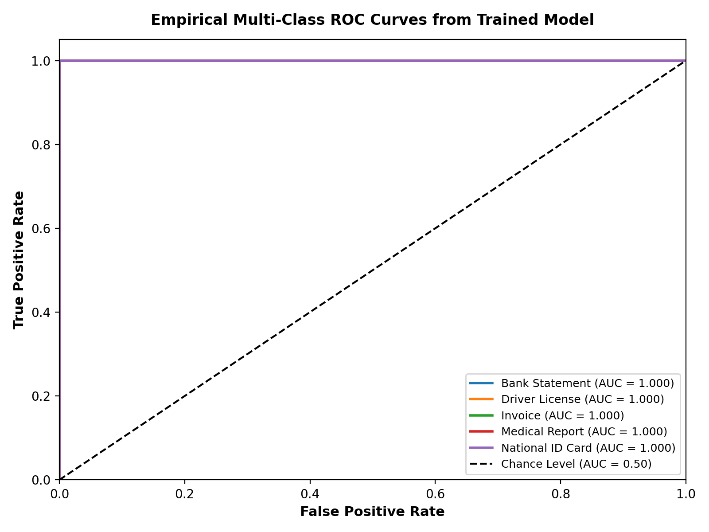 | 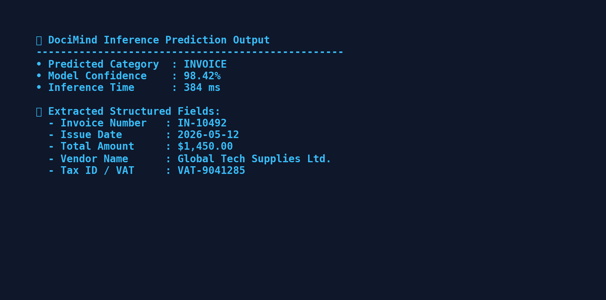 |

| 9. Streamlit Interactive Dashboard | 10. Structured Export Output (JSON/CSV) |
| :---: | :---: |
| 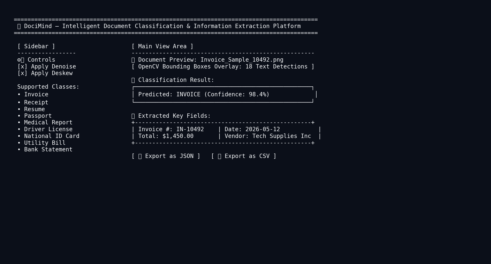 | 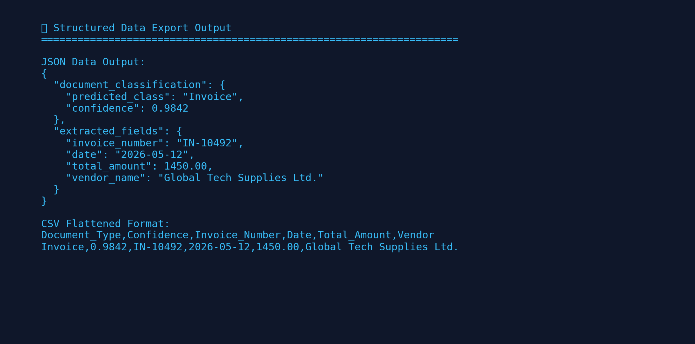 |

---

## 📊 Dataset & Pipeline Training

The DociMind training pipeline was developed using a curated dataset of multi-class document images sourced from Kaggle. 

- **Data Acquisition**: Downloaded via `kagglehub` API into structured class directories.
- **OCR Text Generation**: Extracted text content from hundreds of training document samples using EasyOCR.
- **Feature Engineering**: Built TF-IDF n-gram vector representations (unigrams & bigrams) from extracted document text.
- **Model Selection & Evaluation**: Evaluated multiple classification algorithms:
  - **Logistic Regression**
  - **Random Forest Classifier**
  - **Support Vector Machine (SVM)**
  - **LightGBM Classifier** *(Selected for final production deployment)*
- **Artifact Export**: Serialized the optimal trained model, vectorizer, and label encoder into lightweight `.joblib` artifacts.

> 📓 **Notebook**: Explore the complete training pipeline in [`notebooks/01_docimind_training_pipeline.ipynb`](notebooks/01_docimind_training_pipeline.ipynb).

---

## 💻 Tech Stack

| Domain | Technologies Used |
| :--- | :--- |
| **Language** | `Python 3.12+` |
| **Computer Vision** | `OpenCV`, `Pillow`, `NumPy` |
| **OCR Engine** | `EasyOCR`, `PyTorch` |
| **Machine Learning** | `Scikit-Learn`, `LightGBM`, `Joblib` |
| **NLP & Entity Extraction** | `spaCy (en_core_web_sm)`, `Regex` |
| **Web UI & Visualization** | `Streamlit`, `Matplotlib`, `Seaborn` |
| **Quality & Type Safety** | `Pyright`, `Pytest` |

---

## 🚀 Quick Start & Installation

### Prerequisites
- Python `3.10` or higher (Python `3.12` recommended)
- `pip` package manager
- Git

### 1. Clone Repository
```bash
git clone https://github.com/Anasnaveed69/DociMind.git
cd DociMind
```

### 2. Create & Activate Virtual Environment
- **Windows**:
  ```bash
  python -m venv venv
  venv\Scripts\activate
  ```
- **Linux / macOS**:
  ```bash
  python -m venv venv
  source venv/bin/activate
  ```

### 3. Install Dependencies
```bash
pip install -r requirements.txt
python -m spacy download en_core_web_sm
pip install -e .
```

---

## 💡 Usage Guide

### 1. Running the Web Application
Launch the interactive Streamlit dashboard locally:
```bash
streamlit run app.py
```
Open your browser at `http://localhost:8501`. Drag and drop any document image (JPEG, PNG, WEBP) to classify and extract fields in real time.

### 2. Python API Inference
You can integrate DociMind directly into your Python backend:

```python
from docimind.pipeline import DocumentPipeline

# Initialize pipeline
pipeline = DocumentPipeline()

# Run classification and extraction on a document
results = pipeline.process_document("path/to/invoice.jpg")

print(f"Document Type: {results['document_type']}")
print(f"Confidence Score: {results['confidence']:.2f}")
print("Extracted Entities:", results['extracted_fields'])
```

---

## 📁 Repository Structure

```
DociMind/
├── Output_Images/                         # Screenshots & visual performance artifacts
├── models/                                # Trained model artifacts (.joblib)
│   ├── docimind_classifier.joblib         # LightGBM / Scikit-Learn Classifier
│   ├── label_encoder.joblib               # Class Label Encoder
│   └── tfidf_vectorizer.joblib            # TF-IDF Feature Extractor
├── notebooks/                             # Data science & training notebooks
│   └── 01_docimind_training_pipeline.ipynb# End-to-end Colab training pipeline
├── scripts/                               # Training helper scripts
│   └── train_model_artifacts.py
├── src/                                   # Source code package
│   └── docimind/
│       ├── ml/                            # Classifier & text clean utilities
│       │   ├── classifier.py
│       │   ├── feature_extractor.py
│       │   └── text_cleaner.py
│       ├── nlp/                           # spaCy loader & 9 specialized extractors
│       │   ├── extractors/                # Domain-specific rule extractors
│       │   │   ├── bank_statement_extractor.py
│       │   │   ├── driver_license_extractor.py
│       │   │   ├── id_card_extractor.py
│       │   │   ├── invoice_extractor.py
│       │   │   ├── medical_extractor.py
│       │   │   ├── passport_extractor.py
│       │   │   ├── receipt_extractor.py
│       │   │   ├── resume_extractor.py
│       │   │   └── utility_bill_extractor.py
│       │   ├── base_extractor.py
│       │   └── spacy_loader.py
│       ├── ocr/                           # EasyOCR wrapper & bounding box generator
│       │   └── ocr_engine.py
│       ├── preprocessor/                  # OpenCV image restoration & deskewing
│       │   └── image_preprocessor.py
│       ├── utils/                         # Exporters & visualizers
│       │   ├── export_utils.py
│       │   └── visualizer.py
│       ├── config.py                      # Global regex & config constants
│       └── pipeline.py                    # Master orchestrator
├── tests/                                 # Test suite
│   └── test_docimind.py
├── app.py                                 # Streamlit Web App entry point
├── pyrightconfig.json                     # Static type checker configuration
├── requirements.txt                       # Project dependencies
└── setup.py                               # Package installation script
```

---

## 🔮 Future Improvements

- [ ] **Multimodal Transformer Integration**: Add support for LayoutLMv3 / Donut for zero-shot visual document understanding.
- [ ] **REST API Endpoint**: Package pipeline into a high-throughput FastAPI microservice with Docker containerization.
- [ ] **Multi-Page PDF Processing**: Enable multi-page PDF rendering and batch document queue processing.
- [ ] **Cloud Storage Integration**: Direct connector support for AWS S3 and Google Cloud Storage buckets.

---

## 📄 License & Acknowledgments

Distributed under the **MIT License**. See `LICENSE` for more details.

Developed as a Principal AI/ML Portfolio Project under the AI/ML Engineering Program (**Offer ID: `CAX-OL-2026-283`**). Built using open-source tools: [OpenCV](https://opencv.org), [EasyOCR](https://github.com/JaidedAI/EasyOCR), [Scikit-Learn](https://scikit-learn.org), [spaCy](https://spacy.io), and [Streamlit](https://streamlit.io).

---

<div align="center">
  <sub>Built with ❤️ by <a href="https://github.com/Anasnaveed69">Anas Naveed</a></sub>
</div>
